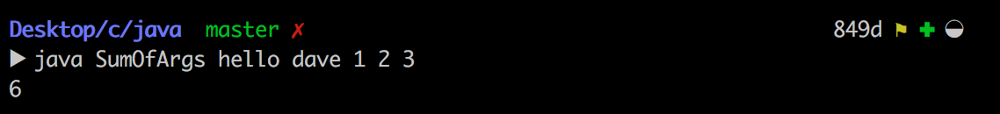
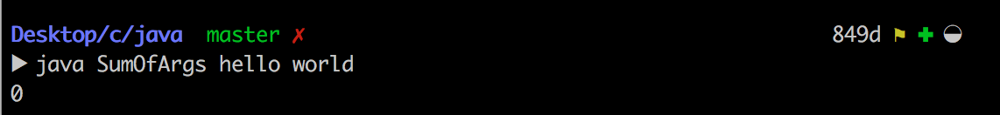
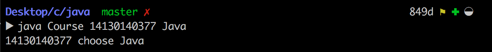
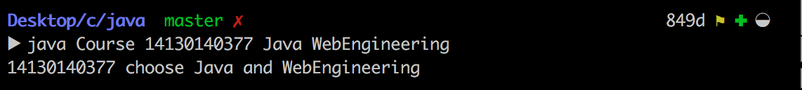
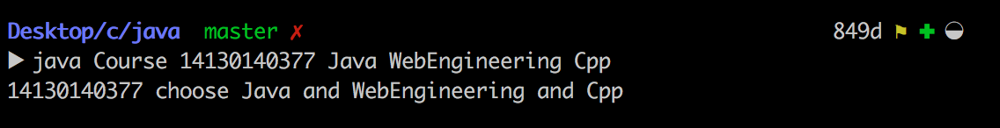

##java技术第一次上机报告

>Author：康赣鹏
>
>StudentID：14130140377
>
>Email：1159838847@qq.com

* Assignment：Get JDK installed and working well
* Notes:java class name should be the same as the file name(.java)

###1.Experiment one:Sum Of Arguments

* 1.1 Requirement:
	* Create a class named SumOfArgs that will print out the sum of all integer arguments found on the command line. It should have a main() method so the class can be run. Anything that is not an integer should be skipped (should not contribute to the sum). It should print out only the sum (nothing else!). No error messages can be printed out (no matter what the command line args look like). 
* 1.2 Process and key point:
	* I use the method Integer.parseInt(String s) which can transform string to integer.If the string it received cannot be transformed to integer,it would remind me.I can handle the exception according to the message i got from the method.
	* I use the try and catch to catch all the fault.The left string can be transformed to integer and summed altogether.Here is the key code.

			for(String str : args)
	 	   	{
  			    int temp = 0;
 			     try
 			     {
 			     /*the legal string can be transformed 
 			     to integer*/
  			      temp = Integer.parseInt(str);
  			     }
 		   	  catch(NumberFormatException e)
 		   	  {
		   	     temp = 0;
		   	     continue;
 		   	  }
 		   	  sum = sum + temp;
 			}
 		
 		
* 1.3 Result:
	* 
	* 
	* 
	* 

###2.Experiment two:Book, Course, Student

* 2.1 Requirement:
	* Create three classes named Book, Course and Student to perform simple course-selecting system. Student has at least three overloaded constructors with different parameter list. Student also has some members of Book.
* 2.2 Process and key point:
	* __class Book__:the main members and methods i designed.

			private String Bookname;
			private String author;
  			public Book(String temp)
  			{//set the book name
    			Bookname = temp;
  			}
  			public String get_book_name()
  			{//get the book name
    			return this.Bookname;
  			}

	* I can get the bookname easily through the method get__book_ _name.
	* __class Course__:class course was the role who control the course selecting system.Users can use the class Course to choose the course they like.
	* the main members and methods i designed.

			public String Coursename;
  			public Course(String temp)
  			{//set course name
    			Coursename = temp;
  			}
  			public String get_course_name()
  			{//get the course name
    			return this.Coursename;
  			}

	* To receive the parameters ,i designed the main method.The key point is to judge the number of parameters.Based on it,i can add the change the parameters correspondingly.Here is the main method:

			public static void main(String[] args)
  			{
  				/*when the number of parameters is 0*/
    			if(args.length == 0)
    			{ ... }
    			/*when the number of parameters is 1*/
    			if(args.length == 1)
    			{ ... }
    			/*when the number of parameters is 2*/
    			if(args.length == 2)
    			{ ... }
    			/*when the number of parameters is 
    			larger than 2*/
    			if(args.length > 2)
    			{
      				Student a = new Student(args[0],args[1]);
      				for(int i = 2;i < args.length;i++)
      				{
        				a.addCourse(args[i]);
      				}
      				System.out.println(a.getCourseName());
    			}
    		}
    		
	*  __class Student__:I use the arraylist to store the booklist and courselist.
	*  the memebers of class student
			
			//store the Student'name and ID
			private String Studentname;
  			private String StudentId;
  			//store the selected Courses and books with arraylist
  			public java.util.ArrayList<Book> SelectedBook;
  			public java.util.ArrayList<Course> SelectedCourse;
	
	*  the three overloaded constructors with different parameter list

			/*Parameter is  student's ID*/
			public Student(String temp_ID)
 			{
 			  this.StudentId = temp_ID;
  			}
  			/*Parameters are student's ID and Course
  			 name*/
  			public Student(String temp_ID,String temp_CourseName)
  			{
    			StudentId = temp_ID;
    			SelectedCourse = new java.util.ArrayList<Course>();
    			SelectedCourse.add(new Course(temp_CourseName));
  			}
  			/*Parameters are student's ID ,Course
  			 name and Book name*/
  			public Student(String temp_ID,String temp_CourseName,String temp_bookName)
  			{
    			StudentId = temp_ID;
    			SelectedBook = new java.util.ArrayList<Book>();
    			SelectedBook.add(new Book(temp_bookName));
    			SelectedCourse = new java.util.ArrayList<Course>();
    			SelectedCourse.add(new Course(temp_CourseName));
  			}
* 2.3 Result:users can choose a lot of courses.
	* 
	* 
	* 

###3.Reference
* java version "1.8.0_91"
* Java(TM) SE Runtime Environment (build 1.8.0_91-b14)
* Java HotSpot(TM) 64-Bit Server VM (build 25.91-b14, mixed mode)
* SumOfArgs.java
* Book.java
* Student.java
* Course.java
