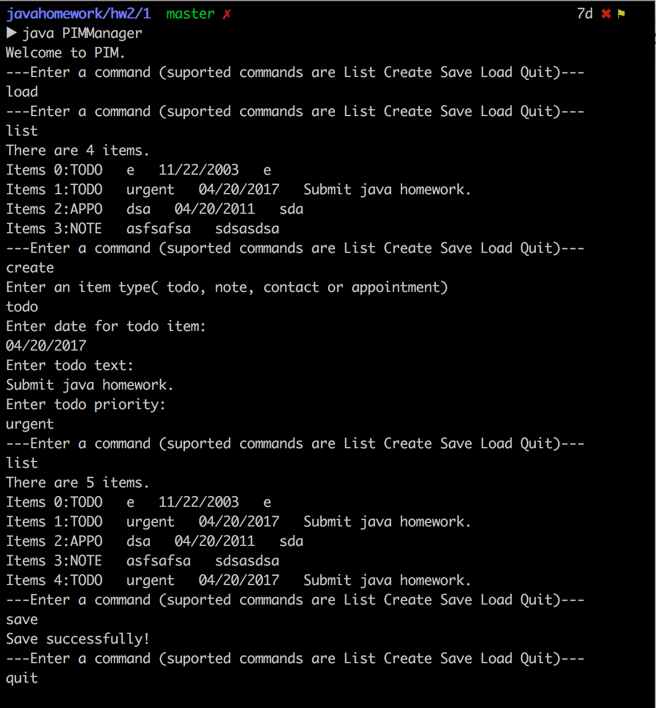
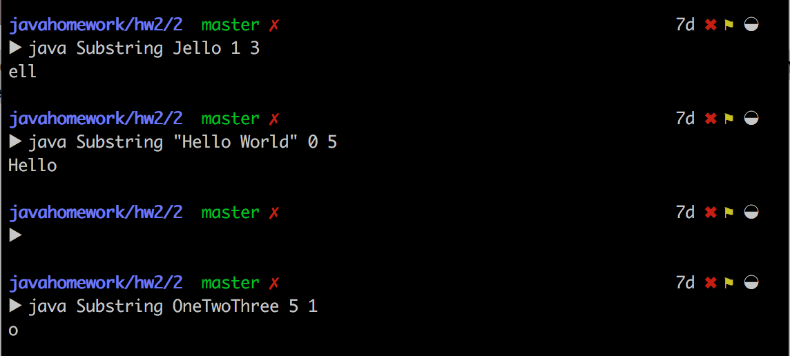
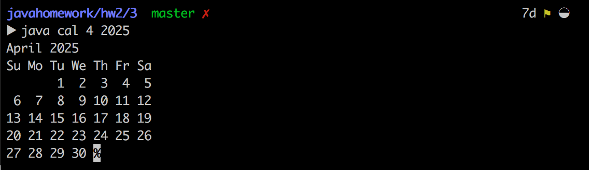

java技术第二次上机报告

           
                  

Author：康赣鹏

StudentID：14130140377

Email：1159838847@qq.com

Teacher：霍秋艳

###Part 1:Command Oriented Personal Information Manager

* 1.1 Requirement:
	* This assignment involves the creation of simple Personal Information Management system that can deal with 4 kinds of items: todo items, notes, appointments and contacts. Each of these kinds of items is described in more detail below. The assignment requires that you create a class for each item type, and that each class extends an abstract base class provided for you. In addition to creating the four classes, you need to create a manager class that supports some simple text-based commands for creating and managing items.
	* the basic abstract class:
				
			public abstract class PIMEntity {
    			String Priority; // every kind of item has a priority

    			// default constructor sets priority to "normal"
    			PIMEntity() {
        			Priority = "normal";
    			}

    			// priority can be established via this constructor.
    			PIMEntity(String priority) {
        			Priority =  priority;
    			}

    			// accessor method for getting the priority string
    			public String getPriority() {
        			return Priority;
    			}
    			// method that changes the priority string
    			public void setPriority(String p) {
        			Priority = p;
    			}

    			// Each PIMEntity needs to be able to set all state information
    			// (fields) from a single text string.
    			abstract public void fromString(String s);

    			// This is actually already defined by the super class
    			// Object, but redefined here as abstract to make sure
    			// that derived classes actually implement it
    			abstract public String toString();
			} 

* 1.2 Process and key point:
	* i used four class---PIMTodo,PIMNote,PIMAppointment,PIMContact---to store the information from the users.A interface PIMDate to manage the time.The class PIMManager will maintain the system running, instantiate the other classes and call their function.
	* With the system i designed,users can store their important affair and look up what they have stored.
	* PIMTodo:
	* The lastest version:the system can store the data in file with the class PIMFile.Class PIMFile can get the data from system write it in the file and then it can read the information from the file.
	* the simple architecture by which i realized:  

		
			public class PIMTodo extends PIMEntity implements PIMDate
			{
  				String Todo;
  				Date Tododate;
  				public PIMTodo(String Priority,String Todo,Date date)
  				{
    				...
  				}
  				public PIMTodo()
  				{
     				...
  				}
 
 * set the todo text via the string temp
  				
  				public void setTodo(String temp)
  				{
     				...
  				}
 * return the todo text
 				
  				public String getTodo()
  				{
     				...
  				}
 * set the todo text date
 
  				public void setDate(Date temp)
  				{
     				...
  				}
 * get the todo text date
 
  				public String getDate()
  				{
     				...
  				}
  				public Date getTododate(String temp)
  				{
     				...
  				}
  				public void setTododate(String temp)
  				{
 	  				...
  				}
	* return the string contain the todo information with a standard format

  				public String toString()
  				{
     				...
  				}
	* get the string from the store 
	* extract the information from string
	
  				public static PIMTodo FromString(String s)
  				{
     				...
  				}

  				public void fromString(String s)
  				{
 	  				...
  				}
  
			}
			
			
	* class PIMManager: to maintain the system running
		
			public class PIMManager
			{
  				private final int listnum = 100;
 				private PIMEntity[] list = new PIMEntity[100];
  				private int listcount = 0;
  				File file = new File("PIMEntity.txt");

	* upcast the four class to their parent class and store them in PIMEntity array for the reason that i can store them uniformly.
	
  				public void addPIMEntity(PIMEntity temp)
  				{
					...
  				}
	* the function users can call
	
  				public void create()
  				{
   					...
  				}
  				public void createTodo()
  				{
    				...
      			}
  				public void createAppointment()
  				{
    				...  
    			}
  				public void createNote()
  				{
    				...

  				}
  				public void createContact()
  				{
					...
  				}

  				public Date formatdate(String item)
  				{
    				...  
    			}

  				public void list()
  				{
    				...
  				}

  				public void Save()
  				{
					...
  				}
  				public void Load()
  				{
    				...  
    			}

  				public void manageSystem()
  				{
					...  
				}

  				public static void main(String[] args)
  				{
    				PIMManager manager = new PIMManager();
    				manager.manageSystem();

  				}
			}

* 1.3 Result:
	*  		
	
	
###Part 2:Command Oriented Personal Information Manager		

* 2.1 Requirement:
	* Create a class named Substring that will expect the first command line argument to be a string, and the second two command line arguments to be integers, the first will be used as an index and the second as a length. The output should be the subtring of string starting at the index and of the specified length. 
* 2.2 Process and key point: 
	* I used the API SubString to extract the string needed and Integer's parseInt to parse the char to int.  
	* code list:

			public class Substring
			{
  				String substring;
  				public Substring(String temp,int first,int second)
  				{
    				substring = temp.substring(first,first+second);
  				}
  				public String getsubstring()
  				{
    				return this.substring;
  				}
  				public static void main(String args[])
  				{
    				Integer firstnum = Integer.parseInt(args[1]);
    				Integer secondnum = Integer.parseInt(args[2]);
    				Substring temp = new Substring(args[0],firstnum,secondnum);
    				String subtemp = temp.getsubstring();
    				System.out.println(subtemp);
  				}
			}
			
	
* 2.3 Result:

	*  

###Part 3:Calendar generating program

* 3.1 Requirement:
	* Write a java program named cal (the main() should be in a class named "cal") that will print out to standard output the calendar for any month. Your program should look at the command line arguments for a numeric month and year, and print the calendar for that month in the format displayed below. If there are no command line arguments, or if the command line arguments are not a valid month and year, your program must print the calendar for the current month. This program is a java version of the Unix "cal" command.the program should print out the month and year, followed by the days of the week (using the same abbreviation as shown above) and the dates in the month. Your program must produce a tabular output exactly like the above examples, the only difference should be the exact position of the dates (which depend on the specific month asked for). It is required that the columns of the calendar line up just like the above examples!
* 3.2 Process and key point:  
	* I use the java.util.Calendar object with two API.
	* calendar.getActualMaximum(Calendar.DAY_OF_MONTH)
	* calendar.get(Calendar.DAY_OF_WEEK)
	* SimpleDateFormat(to format the date)
	* code list:
	
			public class cal
			{
  			static String[] Month={"January","February","March","April","May","June","July","August","September","October","November","December"};
  			
  	* get the days of the month
  			
  				public static int getDaysOfMonth(Date date)
  				{
    				Calendar calendar = Calendar.getInstance();
    				calendar.setTime(date);
    				return calendar.getActualMaximum(Calendar.DAY_OF_MONTH);
  				}
  				
  	* get 
  				public static int getDaysOfWeek(Date date)
  				{
   					Calendar calendar = Calendar.getInstance();
    				calendar.setTime(date);
    				return calendar.get(Calendar.DAY_OF_WEEK);
  				}
  				public static int StrToInt(String s)
  				{
					...
  				}

	* display the calendar

  				public static void main(String[] args)
  				{
    				if(args.length == 2)
    				{
      					String month = args[0];
      					String year = args[1];
      					int m = StrToInt(month);
      					System.out.println(Month[m-1]+" "+year);

      				try
      				{
        				int Days;
        				int WeekDay;

        				SimpleDateFormat sdf = new SimpleDateFormat("yyyy-MM");
        				Days = getDaysOfMonth(sdf.parse(year+"-"+month));
        				WeekDay = getDaysOfWeek(sdf.parse(year+"-"+month));

        				System.out.println("Su Mo Tu We Th Fr Sa");
        				int day = 1;
        				System.out.print(" ");
        				for(int i = 1;i <= Days+WeekDay-1;i++)
        				{
          				if(i < WeekDay)
          				{
            					System.out.print("   ");
          				}
          				else
          				{
            				if(day < 9)
            				{
              				System.out.print(day+"  ");
            				}
            				else
           					{
             					System.out.print(day+" ");
           					}
           					day++;
          				}
          				if(i%7 == 0)
          				{
            				if(day < 9)
            				{
              					System.out.println();
              					System.out.print(" ");
            					}
            					else
            					{
              						System.out.println();
            					}
          					}
        				}
      				}
      				catch(Exception e)
      				{
        				System.out.println(e);
      				}
    			}
    			else
    			{
      				System.out.println("illegal input");
    			}
  			}
		

* 3.3 Result:
	*   

